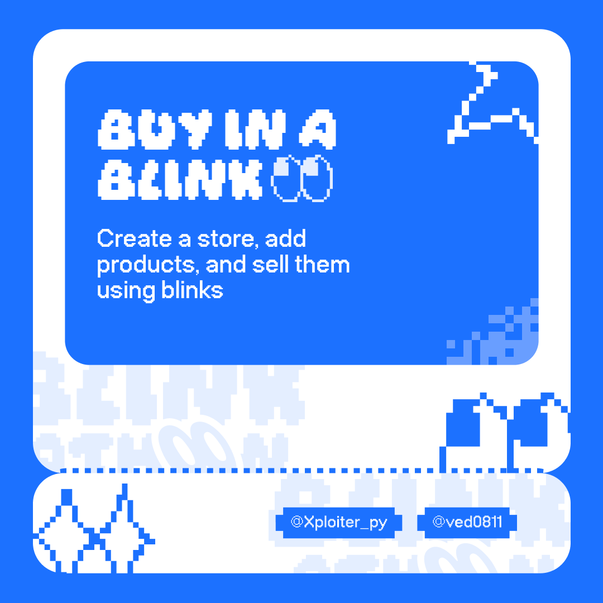

# Disclaimer
*This project was built as a part of [blinkathon hackathon](https://blinkathon.fun). This is still an MVP and on devnet. So use it at your own risk*
# Description
Buy in a Blink is an E-commerece platform where merchants can create their own store, add products and get a custom link for the store which can be shared online in platforms like X. On posting the link, it unfurls into a blink and the users can shop from the store directly from X.

We've implemented an escrow contract in the backend. Whenever a user buys something, the amount is sent to the escrow. The funds are released to the seller only when the product is delivered. If by any chance, the order is cancelled, a refund is automatically initiated to the user.

# Future Scope
We would like to integrate our platform with shopify so that merchants create a blink for their shopify store
There are many cases when a product is marked delivered but it is not actually delivered. We will work more on this issue and implement a ZKP to ensure that product is actually delivered. 

# Links
### Website
[buyinablink.xyz](https://buyinablink.xyz)
### Sample Blink
[buyinablink.xyz/ved0811](https://dial.to/developer?url=https%3A%2F%2Fwww.buyinablink.xyz%2Fved0811&cluster=devnet)